# luks-trim

Enable discard propagation for encrypted Talos + Longhorn stacks so deleted data can be reclaimed all the way down to the VM disk.

## Why this chart exists

In a nested storage path like:

`Longhorn volume -> Talos encrypted storage -> VM sparse disk`

writing files grows every layer, but deleting files usually only reduces logical filesystem usage.
Without discard + trim propagation, allocation in lower layers often stays high.

## The problem (no trim propagation)



## The desired outcome (discard + trim propagation)



## What luks-trim does

- Runs as a scheduled CronJob coordinator that spawns one short-lived worker Job per selected node.
- Enables `allow-discards` on encrypted Longhorn dm-crypt devices.
- Enables `allow-discards` on Talos encrypted dm-crypt devices.
- Runs `fstrim` for Talos-mounted filesystems to propagate discard to the VM backing disk.
- Supports dry-run verification mode for key and connectivity checks.
- Handles mixed encrypted and unencrypted Longhorn volumes.

## What luks-trim does not do

- It does not execute Longhorn's own filesystem trim recurring job.
- Longhorn reclaim still requires a Longhorn `RecurringJob` of type `filesystem-trim`.
- It assumes a single Talos KMS endpoint per node when using KMS-based Talos keys.

## Quick start

Prerequisites:

- Kubernetes 1.27+
- Longhorn installed (if using the Longhorn path)
- Talos nodes for Talos system-volume processing
- Helm 3

Create a values file (example):

```yaml
namespace: luks-trim

schedule: "0 2 * * 0"
timezone: "UTC"

dryRun: false

longhorn:
  enabled: true
  globalKey:
    enabled: true
    secretName: longhorn-global-key
    secretNamespace: longhorn-system
    secretKey: CRYPTO_KEY_VALUE

talos:
  enabled: true
  kmsEndpoint: "https://kms.example.com:50051"
```

Install:

```bash
helm upgrade --install luks-trim . -n luks-trim
```

Run once immediately:

```bash
kubectl create job \
  --from=cronjob/luks-trim \
  -n luks-trim \
  luks-trim-manual-$(date +%s)
```

Watch worker logs:

```bash
kubectl logs -n luks-trim -l luks-trim/role=worker --tail=200 --prefix
```

## Configuration reference

The full project behavior and configuration rationale are documented inline in [values.yaml](values.yaml).
That file is intentionally comment-heavy and should be treated as the authoritative reference.

## Notes for Longhorn users

For encrypted Longhorn volumes, the expected flow is:

1. `luks-trim` enables `allow-discards` on the volume's dm-crypt mapping.
2. Longhorn `filesystem-trim` RecurringJob performs the volume filesystem trim.
3. Talos-level `fstrim` reclaims from node filesystems down to VM backing storage.

## Development and CI

- Integration workflow: [.github/workflows/integration-test.yml](.github/workflows/integration-test.yml)
- Talos dev debug workflow (branch/worktree debugging): [.github/workflows/talos-dev-debug.yml](.github/workflows/talos-dev-debug.yml)
- Helper script for GitHub Actions loops: [scripts/gha-loop.sh](scripts/gha-loop.sh)
